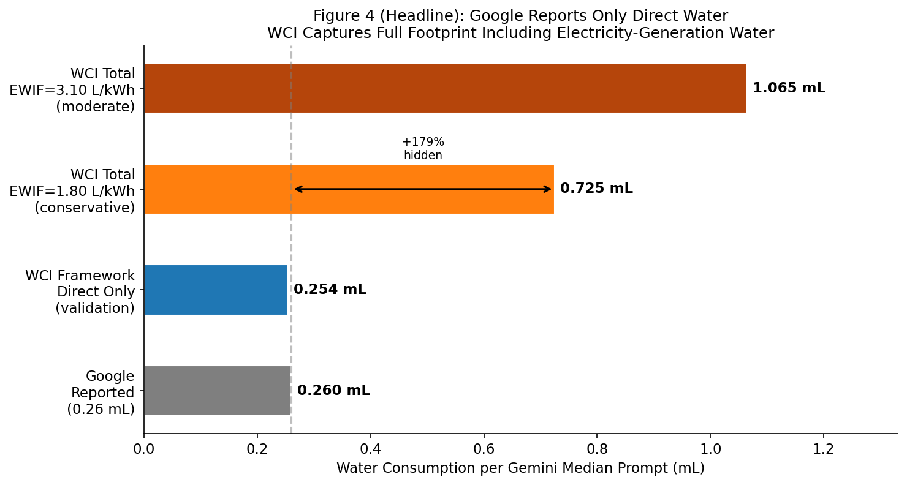
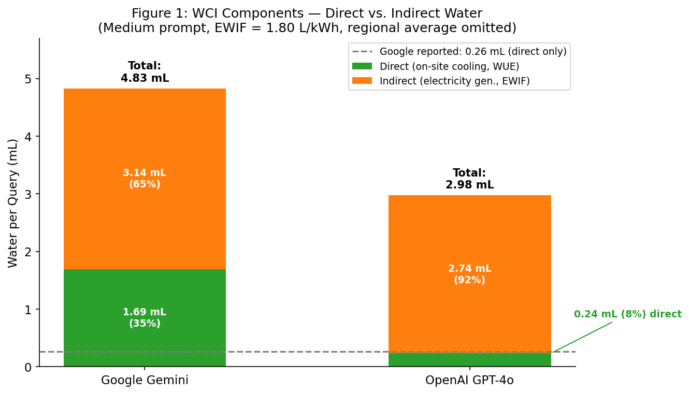
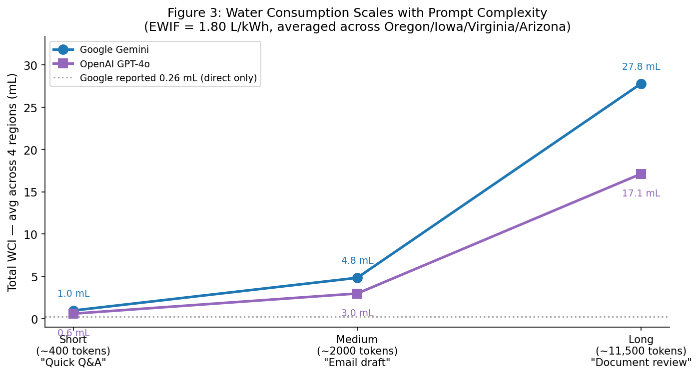
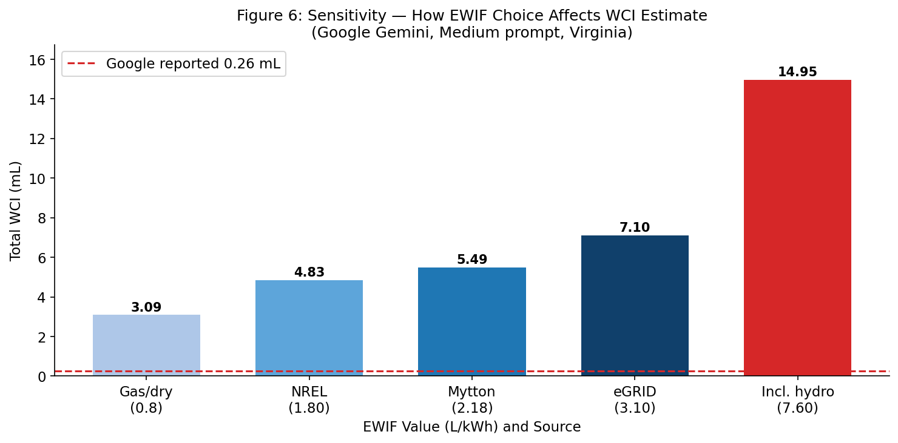
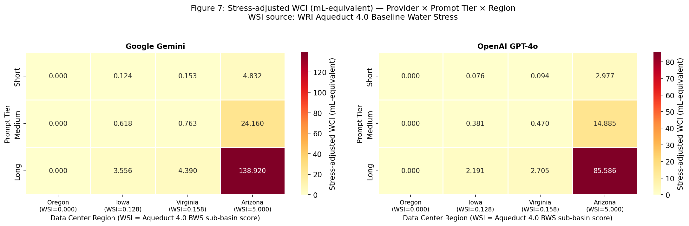

<!-- README for the Hidden Thirst / WCI repository -->

# The Hidden Thirst of AI

### A Framework for Estimating Direct, Indirect, and Scarcity-Adjusted Freshwater Consumption per LLM Query

This repository contains the data, calculations, and figures behind the **Water Cost of Intelligence (WCI)** — a per-query metric for the freshwater footprint of large-language-model inference. WCI combines **direct** on-site cooling water, **indirect** electricity-generation water, and a **regional water-stress adjustment** into a single, transparent, reproducible number.

> **Headline result.** Industry "water-per-query" disclosures count only on-site cooling. When the electricity-generation water that powers the query is added back, the per-query freshwater footprint of a Google Gemini median prompt rises from the disclosed **0.260 mL** to **0.725 mL — a 179% increase** — and regional water scarcity changes the interpretation of identical physical water use by more than two orders of magnitude.

---

## Authors

| Author | Affiliation |
|---|---|
| Bhanu Sharma | College of Science, Northeastern University |
| Amit Tiwari | MET Dept. of Computer Science, Boston University |
| Rashanjot Kaur | MET Dept. of Computer Science, Boston University |
| Kathleen Marshall Park | MET Dept. of Administrative Sciences & Institute for Global Sustainability, Boston University |
| Eugene Pinsky (corresponding — epinsky@bu.edu) | MET Dept. of Computer Science, Boston University |

Submitted to *Energies* (MDPI), 2026.

---

## Why this matters

AI sustainability reporting has converged on energy and carbon, but freshwater remains inconsistently measured. Two disclosures with identical numbers can describe very different physical realities if their **accounting boundary** differs. WCI makes the boundary explicit and shows that:

1. **Direct-only reporting is incomplete.** On-site cooling water (what providers disclose) is the minority of the true footprint.
2. **Indirect water dominates.** Water evaporated at power plants to generate the query's electricity is 65–92% of total WCI under our assumptions.
3. **Location is decisive.** The same query served from water-rich Oregon versus water-stressed Arizona differs by orders of magnitude once scarcity is accounted for.

---

## The WCI metric

$$W_{\text{direct}} = \frac{E_{\text{query}}\,(1 - f_{\text{overhead}})}{1000} \times \text{WUE} \times 1000$$

$$W_{\text{indirect}} = \frac{E_{\text{query}}}{1000} \times \text{PUE} \times \text{EWIF} \times 1000$$

$$W_{\text{total}} = W_{\text{direct}} + W_{\text{indirect}} \qquad W_{\text{stress}} = W_{\text{total}} \times \text{WSI}$$

| Term | Meaning | Units |
|---|---|---|
| **WUE** | Water Usage Effectiveness — on-site cooling water per kWh of IT energy | L/kWh |
| **PUE** | Power Usage Effectiveness — total facility energy / IT energy | — |
| **EWIF** | Energy Water Intensity Factor — water evaporated at power plants per kWh generated | L/kWh |
| **WSI** | Water Stress Index — regional scarcity weight (WRI Aqueduct 4.0 Baseline Water Stress, 0–5) | — |

---

## Key inputs

| Parameter | Value | Source |
|---|---|---|
| Google Gemini energy / query | 0.24 Wh | Elsworth et al. 2025, arXiv:2508.15734 |
| Google Gemini direct water / query | 0.26 mL | Elsworth et al. 2025 (ISO WUE Category 2) |
| OpenAI GPT-4o energy / query | 0.34 Wh | Altman, *The Gentle Singularity* (2025) |
| OpenAI GPT-4o reported water / query | 0.322 mL | Altman (2025), boundary unstated |
| Google WUE / PUE | 1.15 L/kWh / 1.09 | Elsworth et al. 2025; Google Env. Report 2025 |
| OpenAI WUE / PUE (AWS proxy) | 0.19 L/kWh / 1.12 | AWS Sustainability Report 2023 via Jegham et al. 2025 |
| EWIF (primary) | 1.80 L/kWh | NREL TP-550-33905; Green Grid WP#35 |
| Prompt tiers (Short / Medium / Long) | 400 / 2,000 / 11,500 tokens | Jegham et al. 2025 |

**Regional water stress (WRI Aqueduct 4.0 Baseline Water Stress, by data-center sub-basin):**

| Site | Sub-basin | WSI (0–5) | Stress band |
|---|---|---|---|
| The Dalles, Oregon | Middle Columbia / Hood | 0.000 | Low |
| Council Bluffs, Iowa | Big Papillion / Mosquito | 0.128 | Low |
| Ashburn / Loudoun, Virginia | Middle Potomac / Catoctin | 0.158 | Low |
| Mesa, Arizona | Lower Salt | 5.000 | Extremely High |

---

## Results

### Direct-water validation
Reconstructing Google's own boundary reproduces its disclosure to within **2.3%** (0.254 mL computed vs. 0.260 mL reported), confirming the framework is consistent with industry methodology before the boundary is expanded.

<p align="center"></p>
<p align="center"><em>Direct-water validation and boundary expansion: the WCI direct component matches Google's disclosure, and full WCI rises once electricity-generation water is added.</em></p>

### Full WCI across 24 provider × tier × region scenarios (EWIF = 1.80 L/kWh)

| Provider | Tier | Energy (Wh) | Direct (mL) | Indirect (mL) | **Total (mL)** | Indirect share |
|---|---|---:|---:|---:|---:|---:|
| Google Gemini | Short | 0.320 | 0.339 | 0.628 | **0.966** | 65.0% |
| Google Gemini | Medium | 1.600 | 1.693 | 3.139 | **4.832** | 65.0% |
| Google Gemini | Long | 9.200 | 9.734 | 18.050 | **27.784** | 65.0% |
| OpenAI GPT-4o | Short | 0.272 | 0.047 | 0.548 | **0.595** | 92.1% |
| OpenAI GPT-4o | Medium | 1.360 | 0.235 | 2.742 | **2.977** | 92.1% |
| OpenAI GPT-4o | Long | 7.820 | 1.352 | 15.765 | **17.117** | 92.1% |

<p align="center"> </p>
<p align="center"><em>Left: direct vs. indirect split for a medium prompt — indirect electricity water is the larger component for both providers. Right: WCI scales with prompt size from short to long.</em></p>

### Sensitivity to EWIF
EWIF (electricity-generation water intensity) is the largest single source of uncertainty. At the conservative 1.80 L/kWh the Google median prompt is 0.725 mL (+179% over direct-only); at a moderate national-grid 3.10 L/kWh it reaches 1.065 mL (+310%).

<p align="center"></p>
<p align="center"><em>Total WCI for the Google Gemini medium prompt as EWIF varies across its plausible range.</em></p>

### Scarcity-adjusted WCI (mL-equivalent), Aqueduct 4.0

| Provider | Tier | Oregon (0.000) | Iowa (0.128) | Virginia (0.158) | Arizona (5.000) |
|---|---|---:|---:|---:|---:|
| Google Gemini | Short | 0.000 | 0.124 | 0.153 | 4.832 |
| Google Gemini | Medium | 0.000 | 0.618 | 0.763 | 24.160 |
| Google Gemini | Long | 0.000 | 3.556 | 4.390 | 138.920 |
| OpenAI GPT-4o | Short | 0.000 | 0.076 | 0.094 | 2.977 |
| OpenAI GPT-4o | Medium | 0.000 | 0.381 | 0.470 | 14.885 |
| OpenAI GPT-4o | Long | 0.000 | 2.191 | 2.705 | 85.586 |

The same physical query is weighted by local scarcity: Mesa, Arizona is ~32× more scarcity-weighted than Ashburn, Virginia and ~39× more than Council Bluffs, Iowa, while The Dalles, Oregon registers ~0 (no baseline stress). The matrix below visualizes this — Arizona is the single high-stress outlier among the four major U.S. data-center hubs.

<p align="center"></p>
<p align="center"><em>Stress-adjusted WCI (mL-equivalent) across the 24 provider–tier–region scenarios, using Aqueduct 4.0 Baseline Water Stress scores.</em></p>

---

## Reproducing the analysis

```bash
# 1. Environment
python -m venv .venv && source .venv/bin/activate      # Python 3.11+
pip install -r requirements.txt

# 2. Run end to end
jupyter notebook Water_Cost_of_Intelligence_executed.ipynb
#   ... then Kernel ▸ Restart & Run All
```

Every parameter in the notebook is annotated with an inline citation and, where it is an estimate or proxy, an explicit `# ASSUMPTION:` flag. Running all cells reproduces every table and figure in the paper.

---

## Repository structure

```
hidden-thirst/
├── README.md                                  # this file
├── requirements.txt                           # Python dependencies
├── CITATION.cff                               # how to cite this work
├── Water_Cost_of_Intelligence_executed.ipynb  # full analysis (Tasks 1–7 + summary)
└── outputs/                                   # publication figures (regenerated by the notebook)
    ├── google_validation_full_wci.png
    ├── direct_indirect_medium.png
    ├── prompt_scaling.png
    ├── ewif_sensitivity.png
    └── stress_adjusted_wci_heatmap.png
```

---

## Data sources

All energy and water figures come from **published disclosures only**; water values are **consumption** (evaporated), not withdrawal.

- Google Gemini energy & water — Elsworth et al. (2025), *Measuring the environmental impact of delivering AI at Google Scale*, arXiv:2508.15734
- OpenAI GPT-4o energy — S. Altman, *The Gentle Singularity* (2025)
- WUE / PUE — Green Grid White Paper #35; Google Environmental Report 2025; AWS Sustainability Report 2023 (via Jegham et al. 2025)
- EWIF — NREL TP-550-33905 (Torcellini et al. 2003); Mytton (2021); Li et al. (2025, CACM)
- Regional water stress — WRI Aqueduct 4.0 Water Risk Atlas (Baseline Water Stress)
- Prompt tiers — Jegham et al. (2025), *How Hungry is AI?*, arXiv:2505.09598
- Inference energy decomposition — Kaur et al. (2026), *The Carbon Cost of Intelligence*

---

## Citation

If you use this framework or data, please cite:

```bibtex
@article{sharma2026hiddenthirst,
  title   = {The Hidden Thirst of AI: A Framework for Estimating Direct,
             Indirect, and Scarcity-Adjusted Freshwater Consumption per LLM Query},
  author  = {Sharma, Bhanu and Tiwari, Amit and Kaur, Rashanjot and
             Park, Kathleen Marshall and Pinsky, Eugene},
  journal = {Energies},
  year    = {2026},
  note    = {MDPI},
}
```

---

## License

Released for academic use accompanying the manuscript. Please contact the corresponding author (epinsky@bu.edu) regarding reuse.
